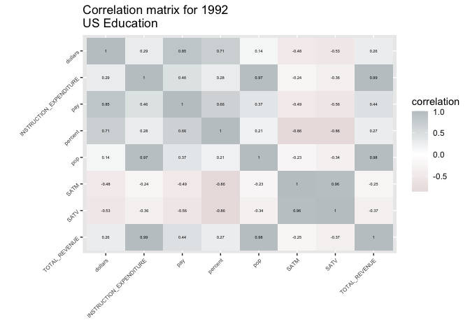
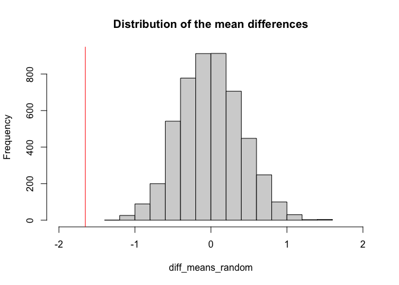
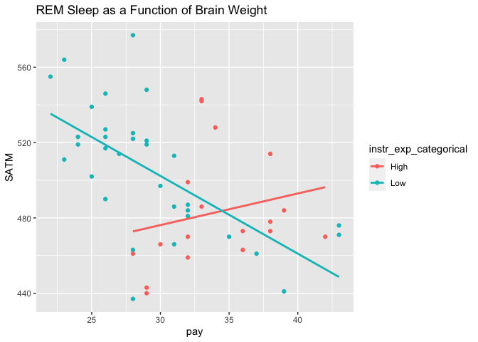
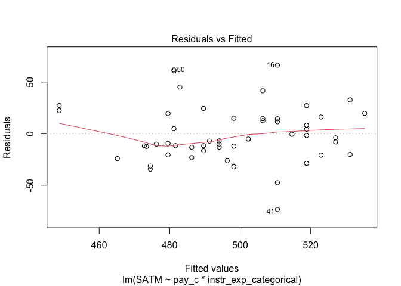
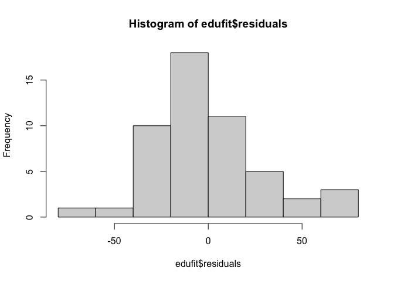
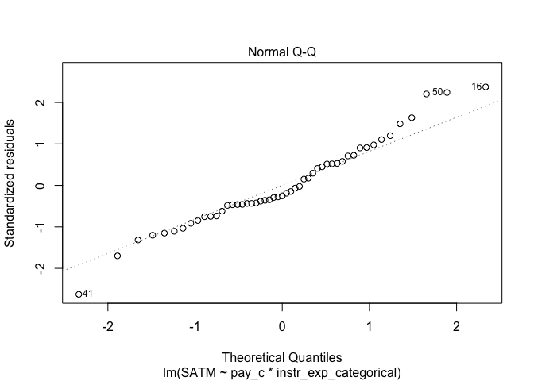
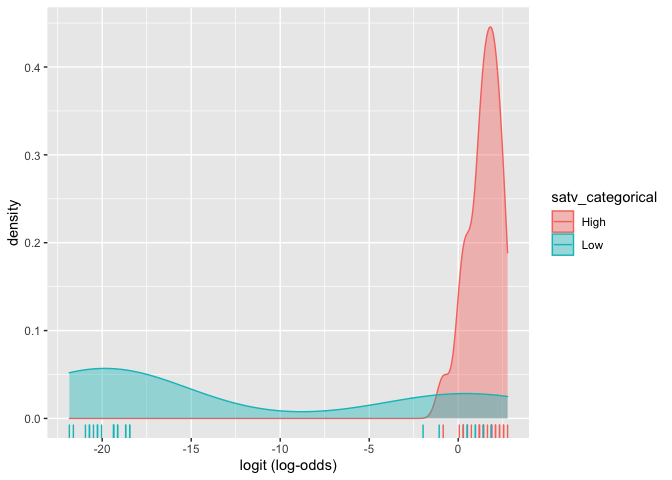
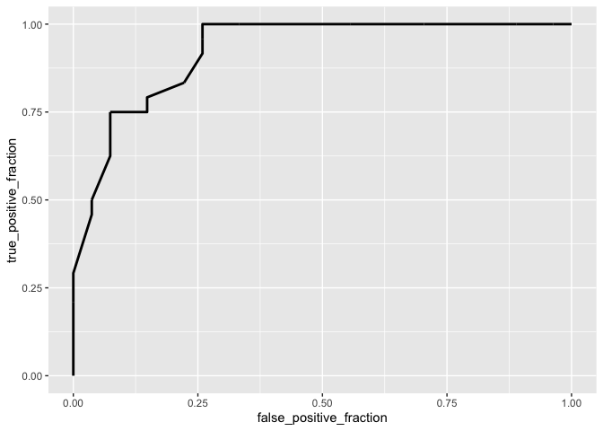

US Education by State - 1992
================
Ritika Chopra (rc47535)

## Introduction

``` r
library(carData)
library(tidyverse)
```

    ## ── Attaching packages ─────────────────────────────────────── tidyverse 1.3.0 ──

    ## ✓ ggplot2 3.3.3     ✓ purrr   0.3.4
    ## ✓ tibble  3.1.0     ✓ dplyr   1.0.5
    ## ✓ tidyr   1.1.3     ✓ stringr 1.4.0
    ## ✓ readr   1.4.0     ✓ forcats 0.5.1

    ## ── Conflicts ────────────────────────────────────────── tidyverse_conflicts() ──
    ## x dplyr::filter() masks stats::filter()
    ## x dplyr::lag()    masks stats::lag()

``` r
### IMPORTING DATA
#load States data from cardata package into environment, name it States.edu1, and convert rownames to column
data(States)
States.edu1 <- rownames_to_column(States, "State")
#set working directory and import second set of education and states data
setwd("~/Downloads")
States.edu2 <- read.csv("states_all.csv")
#import state names & abbreviation data
State.Abbr<- read.csv("csvData.csv")
### CLEANING STATES.EDU1 FOR JOINING PURPOSES
#rename column on States.edu1 so that there is a match when joining two datasets
States.edu1 <- States.edu1%>%
rename(Code = State)
#recode data in States.edu1 so that they match with States.Abbr instances
States.edu1 <- States.edu1 %>%
mutate(Code = recode(Code, 'CN' = 'CT'))

### JOINS
#Join States.edu1 and state abbreviation datasets
States.edu1 <- States.edu1%>%
full_join(State.Abbr, by="Code") %>%
select(-Abbrev)
#Reorder columns for better readability
States.edu1 <- States.edu1[c(1, 9, 2, 3, 4, 5, 6, 7, 8)]
#Recode all states in States.edu1 to match States.edu2 instances
States.edu1$State = toupper(States.edu1$State)
States.edu1$State <- gsub(" ", "_", States.edu1$State)
#Create a primary_key column in States.edu1
States.edu1 <- States.edu1 %>%
mutate(PRIMARY_KEY = paste("1992", State, sep = "_"))
#Join States.edu1 with States.edu2 on the primary key column
States.edu3 <- States.edu1%>%
left_join(States.edu2, by="PRIMARY_KEY")%>%
select(-10, -11, -13, -12, -21, -28, -29, -34)
```

This report explores US education data by state in 1992. One data set,
acquired from the carData package in R, provides information like the
population of the state in 1992, average SAT scores for both components
(math and verbal), and the percentage of graduating high school students
in the state who took the SAT exam. Another data set, acquired from
Kaggle, provides education data per state from 1992 to 2019. It includes
information like state expenditure related to education and a breakdown
of students enrolled in schools by school year. Finally, the third data
set simply provides the state associated with the state abbreviation.
This was acquired from the World Population Review, just to make joining
the two previous data sets easier. The data was already tidy, but to
make it easier to work with I had to re-code some of the abbreviations
so that there was a matching key variable between the three data sets.

Education has always been a topic of interest to me, especially as I
delve deeper into the U.S. education as a student myself. I have
experienced the education system in depth in two different states,
spending the first 18 years of my life in Colorado before coming to
Texas for college. As such, the discrepancies between education in both
states has always intrigued me, and I have been interested in
understanding this in a broader context as well. Although this
information is outdated, it is always valuable to understand historical
data to get a grasp of if and how the education system has developed for
the better over the years. One of the associations that I expect to find
is that the states who tend to spend more on education will see higher
average scores on standardized tests. Another association is that states
who have less participation in tests will see higher average scores as
well.

## Exploratory Data Analysis

``` r
#Create categorical variable that categorizes percentage of SAT students in the state who took the exam as either high or low 
States.edu3 <- States.edu3 %>%
  mutate(SATparticipation = ifelse(percent >= 50, "High", "Low"))

#Create categorical variable that classifies whether a state is spending more or less on education in relation to other states in 1992
States.edu3 <- States.edu3 %>%
  mutate(meaninsexp = mean(INSTRUCTION_EXPENDITURE)) %>%
  mutate(instr_exp_categorical = ifelse(INSTRUCTION_EXPENDITURE >= meaninsexp, "High", "Low"))

#Find the number of states that fall in each category for SAT Participation rates
States.edu3 %>%
  select(SATparticipation) %>%
  group_by(SATparticipation) %>%
  summarize(n())
```

    ## # A tibble: 2 x 2
    ##   SATparticipation `n()`
    ##   <chr>            <int>
    ## 1 High                18
    ## 2 Low                 33

``` r
#Mean of state spending on public education depending on whether or not they have high SAT participation rates
States.edu3 %>%
  group_by(SATparticipation) %>%
  summarize(mean(dollars))
```

    ## # A tibble: 2 x 2
    ##   SATparticipation `mean(dollars)`
    ##   <chr>                      <dbl>
    ## 1 High                        6.24
    ## 2 Low                         4.59

``` r
#Mean of SAT verbal scores depending on region
States.edu3 %>%
  group_by(region) %>%
  summarize(mean(SATV))
```

    ## # A tibble: 9 x 2
    ##   region `mean(SATV)`
    ##   <fct>         <dbl>
    ## 1 ENC            451.
    ## 2 ESC            476.
    ## 3 MA             417.
    ## 4 MTN            462.
    ## 5 NE             429.
    ## 6 PAC            427.
    ## 7 SA             417.
    ## 8 WNC            493.
    ## 9 WSC            459.

``` r
#Correlation heat map
States.edu3.num <- States.edu3 %>%
column_to_rownames("State") %>%
select_if(is.numeric)
States.edu3.num <- States.edu3.num %>%
select(1, 2, 3, 4, 5, 6, 7, 12)
cor(States.edu3.num)
```

    ##                                pop       SATV       SATM    percent    dollars
    ## pop                      1.0000000 -0.3381028 -0.2300418  0.2100687  0.1436745
    ## SATV                    -0.3381028  1.0000000  0.9620359 -0.8627954 -0.5268313
    ## SATM                    -0.2300418  0.9620359  1.0000000 -0.8581495 -0.4844477
    ## percent                  0.2100687 -0.8627954 -0.8581495  1.0000000  0.7111474
    ## dollars                  0.1436745 -0.5268313 -0.4844477  0.7111474  1.0000000
    ## pay                      0.3677244 -0.5559238 -0.4853306  0.6630098  0.8476737
    ## TOTAL_REVENUE            0.9815998 -0.3667500 -0.2480021  0.2702711  0.2628193
    ## INSTRUCTION_EXPENDITURE  0.9661415 -0.3581571 -0.2400128  0.2802296  0.2909489
    ##                                pay TOTAL_REVENUE INSTRUCTION_EXPENDITURE
    ## pop                      0.3677244     0.9815998               0.9661415
    ## SATV                    -0.5559238    -0.3667500              -0.3581571
    ## SATM                    -0.4853306    -0.2480021              -0.2400128
    ## percent                  0.6630098     0.2702711               0.2802296
    ## dollars                  0.8476737     0.2628193               0.2909489
    ## pay                      1.0000000     0.4430113               0.4558008
    ## TOTAL_REVENUE            0.4430113     1.0000000               0.9938057
    ## INSTRUCTION_EXPENDITURE  0.4558008     0.9938057               1.0000000

``` r
cor(States.edu3.num) %>%
# Save as a data frame
as.data.frame %>%
# Convert row names to an explicit variable
rownames_to_column %>%
# Pivot so that all correlations appear in the same column
pivot_longer(-1, names_to = "other_var", values_to = "correlation") %>%
# Specify variables are displayed alphabetically from top to bottom
ggplot(aes(rowname, factor(other_var, levels = rev(levels(factor(other_var)))), fill=correlation)) +
# Heatmap with geom_tile
geom_tile() +
# Change the scale to make the middle appear neutral
#scale_fill_gradient2(low="red",mid="white",high="blue") +
# Overlay values
geom_text(aes(label = round(correlation,2)), color = "black", size = 1.5) +
# Give title and labels
labs(title = "Correlation matrix for 1992 \nUS Education", x = "", y = "") + scale_fill_gradient2(low = "#e7dbdb", high = "#c1c8cb", mid="white") + theme(axis.text.x = element_text(angle = 45, hjust = 1, size = 6
)) + theme(axis.text.y = element_text(angle = 45, hjust = 1, size = 6))
```

<!-- -->

18 states show a relatively high SAT participation rate, while 33 states
show a relatively low participation rate.

States with higher SAT participation rates show a higher mean state
spending on public education: the mean for states with high particpation
rates is $6244.61, as compared to $4592.33 for states with lower SAT
participation rates. This is further tested through the randomization
test later in the report.

There seems to be sizeable differences in mean SAT Verbal score across
different regions, showing a range of 75.9047 between the lowest (MA
region) and highest (WNC region). This is a relationship that will be
further explored through an ANOVA test.

CORRELATION MATRIX: This correlation matrix gives the correlation
between all numeric variables. Some that stood out to me specifically
are the strong negative correlation between percent & SATV and percent &
SATM.

Another thing that stood out to me was that there was a moderately high
negative correlation of the dollars variable (state spending on public
education) against SAT Verbal and against SAT Math. This means that the
more money put into public education, the lower the SAT scores tended to
be that year.

One relationship that is explored through linear regression later in the
report is between SAT math scores and average teacher’s salary in the
state. Right now, this correlation matrix is showing a moderately
negative relationship between the two: the less the average teacher’s
salary, the higher the SAT math score tended to be in the year 1992.
This is different from what I would expect.

## MANOVA

``` r
#Conduct MANOVA test to see if at least one of the response variables differ by region
manova_edu <- manova(cbind(SATV, SATM, dollars, pay, TOTAL_EXPENDITURE, INSTRUCTION_EXPENDITURE) ~ region, data = States.edu3)
summary(manova_edu)
```

    ##           Df Pillai approx F num Df den Df    Pr(>F)    
    ## region     8 2.2928    3.247     48    252 9.626e-10 ***
    ## Residuals 42                                            
    ## ---
    ## Signif. codes:  0 '***' 0.001 '**' 0.01 '*' 0.05 '.' 0.1 ' ' 1

``` r
#Since MANOVA was significant, perform univariate ANOVAs
summary.aov(manova_edu)
```

    ##  Response SATV :
    ##             Df Sum Sq Mean Sq F value    Pr(>F)    
    ## region       8  34669  4333.6  14.189 9.536e-10 ***
    ## Residuals   42  12828   305.4                      
    ## ---
    ## Signif. codes:  0 '***' 0.001 '**' 0.01 '*' 0.05 '.' 0.1 ' ' 1
    ## 
    ##  Response SATM :
    ##             Df Sum Sq Mean Sq F value    Pr(>F)    
    ## region       8  45685  5710.6  17.052 6.065e-11 ***
    ## Residuals   42  14065   334.9                      
    ## ---
    ## Signif. codes:  0 '***' 0.001 '**' 0.01 '*' 0.05 '.' 0.1 ' ' 1
    ## 
    ##  Response dollars :
    ##             Df Sum Sq Mean Sq F value    Pr(>F)    
    ## region       8 60.719  7.5899  9.3834 2.581e-07 ***
    ## Residuals   42 33.972  0.8089                      
    ## ---
    ## Signif. codes:  0 '***' 0.001 '**' 0.01 '*' 0.05 '.' 0.1 ' ' 1
    ## 
    ##  Response pay :
    ##             Df Sum Sq Mean Sq F value    Pr(>F)    
    ## region       8 782.92  97.865   6.567 1.547e-05 ***
    ## Residuals   42 625.91  14.903                      
    ## ---
    ## Signif. codes:  0 '***' 0.001 '**' 0.01 '*' 0.05 '.' 0.1 ' ' 1
    ## 
    ##  Response TOTAL_EXPENDITURE :
    ##             Df     Sum Sq    Mean Sq F value   Pr(>F)   
    ## region       8 5.8404e+14 7.3004e+13  3.4483 0.003875 **
    ## Residuals   42 8.8919e+14 2.1171e+13                    
    ## ---
    ## Signif. codes:  0 '***' 0.001 '**' 0.01 '*' 0.05 '.' 0.1 ' ' 1
    ## 
    ##  Response INSTRUCTION_EXPENDITURE :
    ##             Df     Sum Sq    Mean Sq F value   Pr(>F)   
    ## region       8 1.8001e+14 2.2501e+13  3.8641 0.001737 **
    ## Residuals   42 2.4457e+14 5.8231e+12                    
    ## ---
    ## Signif. codes:  0 '***' 0.001 '**' 0.01 '*' 0.05 '.' 0.1 ' ' 1

``` r
#Perform post-hoc analysis for significant ANOVA tests
pairwise.t.test(States.edu3$SATV, States.edu3$region, p.adj="none")
```

    ## 
    ##  Pairwise comparisons using t tests with pooled SD 
    ## 
    ## data:  States.edu3$SATV and States.edu3$region 
    ## 
    ##     ENC     ESC     MA      MTN     NE      PAC     SA      WNC    
    ## ESC 0.03923 -       -       -       -       -       -       -      
    ## MA  0.01062 6.7e-05 -       -       -       -       -       -      
    ## MTN 0.27263 0.20189 0.00043 -       -       -       -       -      
    ## NE  0.04723 0.00017 0.31756 0.00123 -       -       -       -      
    ## PAC 0.04022 0.00017 0.40512 0.00125 0.86822 -       -       -      
    ## SA  0.00140 1.7e-06 0.94709 5.0e-06 0.21014 0.31296 -       -      
    ## WNC 0.00020 0.13212 1.5e-07 0.00151 7.1e-08 1.2e-07 1.0e-10 -      
    ## WSC 0.47504 0.18900 0.00269 0.80743 0.01083 0.00953 0.00027 0.00404
    ## 
    ## P value adjustment method: none

``` r
pairwise.t.test(States.edu3$SATM, States.edu3$region, p.adj="none")
```

    ## 
    ##  Pairwise comparisons using t tests with pooled SD 
    ## 
    ## data:  States.edu3$SATM and States.edu3$region 
    ## 
    ##     ENC     ESC     MA      MTN     NE      PAC     SA      WNC    
    ## ESC 0.36891 -       -       -       -       -       -       -      
    ## MA  0.00467 0.00071 -       -       -       -       -       -      
    ## MTN 0.64953 0.57247 0.00081 -       -       -       -       -      
    ## NE  0.00117 0.00013 0.91842 7.5e-05 -       -       -       -      
    ## PAC 0.02768 0.00386 0.31703 0.00467 0.27718 -       -       -      
    ## SA  1.9e-05 2.2e-06 0.45391 3.2e-07 0.28001 0.03119 -       -      
    ## WNC 0.00032 0.01028 7.9e-08 0.00031 7.4e-10 1.1e-07 1.6e-12 -      
    ## WSC 0.65061 0.20259 0.01825 0.35983 0.00782 0.09760 0.00028 0.00016
    ## 
    ## P value adjustment method: none

``` r
pairwise.t.test(States.edu3$dollars, States.edu3$region, p.adj="none")
```

    ## 
    ##  Pairwise comparisons using t tests with pooled SD 
    ## 
    ## data:  States.edu3$dollars and States.edu3$region 
    ## 
    ##     ENC     ESC     MA      MTN     NE      PAC     SA      WNC    
    ## ESC 0.01015 -       -       -       -       -       -       -      
    ## MA  0.00020 1.7e-07 -       -       -       -       -       -      
    ## MTN 0.04572 0.30787 2.6e-07 -       -       -       -       -      
    ## NE  0.07131 4.8e-05 0.01221 0.00012 -       -       -       -      
    ## PAC 0.70036 0.00387 0.00056 0.01686 0.15571 -       -       -      
    ## SA  0.75134 0.00197 0.00014 0.00806 0.08094 0.90474 -       -      
    ## WNC 0.08900 0.21646 8.1e-07 0.76687 0.00040 0.03656 0.02214 -      
    ## WSC 0.01331 0.91939 2.3e-07 0.36559 6.8e-05 0.00517 0.00275 0.26074
    ## 
    ## P value adjustment method: none

``` r
pairwise.t.test(States.edu3$pay, States.edu3$region, p.adj="none")
```

    ## 
    ##  Pairwise comparisons using t tests with pooled SD 
    ## 
    ## data:  States.edu3$pay and States.edu3$region 
    ## 
    ##     ENC     ESC     MA      MTN     NE      PAC     SA      WNC    
    ## ESC 0.01201 -       -       -       -       -       -       -      
    ## MA  0.09165 0.00029 -       -       -       -       -       -      
    ## MTN 0.01172 0.67444 0.00020 -       -       -       -       -      
    ## NE  0.82063 0.00528 0.11991 0.00409 -       -       -       -      
    ## PAC 0.41732 0.00150 0.31506 0.00098 0.53377 -       -       -      
    ## SA  0.35302 0.04567 0.01056 0.05045 0.21604 0.06875 -       -      
    ## WNC 0.00443 1.00000 7.8e-05 0.61932 0.00143 0.00035 0.01827 -      
    ## WSC 0.00197 0.52494 4.5e-05 0.25128 0.00073 0.00020 0.00742 0.47353
    ## 
    ## P value adjustment method: none

``` r
pairwise.t.test(States.edu3$TOTAL_EXPENDITURE, States.edu3$region, p.adj="none")
```

    ## 
    ##  Pairwise comparisons using t tests with pooled SD 
    ## 
    ## data:  States.edu3$TOTAL_EXPENDITURE and States.edu3$region 
    ## 
    ##     ENC     ESC     MA      MTN     NE      PAC     SA      WNC    
    ## ESC 0.08336 -       -       -       -       -       -       -      
    ## MA  0.04446 0.00100 -       -       -       -       -       -      
    ## MTN 0.02013 0.76121 0.00011 -       -       -       -       -      
    ## NE  0.04283 0.90815 0.00031 0.83616 -       -       -       -      
    ## PAC 0.86662 0.11393 0.03200 0.03128 0.06269 -       -       -      
    ## SA  0.15840 0.52108 0.00121 0.24238 0.38388 0.22024 -       -      
    ## WNC 0.04523 0.97630 0.00030 0.74625 0.92003 0.06684 0.42319 -      
    ## WSC 0.51252 0.29697 0.01411 0.13468 0.21004 0.61884 0.55466 0.22879
    ## 
    ## P value adjustment method: none

``` r
pairwise.t.test(States.edu3$INSTRUCTION_EXPENDITURE, States.edu3$region, p.adj="none")
```

    ## 
    ##  Pairwise comparisons using t tests with pooled SD 
    ## 
    ## data:  States.edu3$INSTRUCTION_EXPENDITURE and States.edu3$region 
    ## 
    ##     ENC     ESC     MA      MTN     NE      PAC     SA      WNC    
    ## ESC 0.10618 -       -       -       -       -       -       -      
    ## MA  0.01669 0.00042 -       -       -       -       -       -      
    ## MTN 0.02188 0.68545 2.9e-05 -       -       -       -       -      
    ## NE  0.05449 0.88942 0.00011 0.76925 -       -       -       -      
    ## PAC 0.91282 0.12931 0.01319 0.02915 0.06944 -       -       -      
    ## SA  0.16960 0.58799 0.00034 0.24105 0.43177 0.21015 -       -      
    ## WNC 0.05329 0.92817 9.2e-05 0.71121 0.95233 0.06852 0.44926 -      
    ## WSC 0.51964 0.34740 0.00512 0.13977 0.24429 0.58828 0.57019 0.25149
    ## 
    ## P value adjustment method: none

``` r
#223 different hypothesis tests were conducted in this entire sequence

#Probability of at least one type I error, assuming an alpha level of 0.05
1 - (0.95^223)
```

    ## [1] 0.9999892

``` r
#Bonferroni adjusted significance level
0.05/223
```

    ## [1] 0.0002242152

MANOVA test null hypothesis: For each response variable, the means for
each region are equal. MANOVA test alternative hypothesis: For at least
one response variable, at least one of the region’s means differs.

The MANOVA test was significant, allowing us to reject the null
hypothesis and perform one-way ANOVA tests. All ANOVA tests were
significant, allowing us to proceed with post-hoc analyses on each
significant response variable.

223 different hypothesis tests were conducted in this entire sequence.
There is a 0.9999 chance of there being at least one type I error,
assuming an alpha level of 0.05. The Bonferroni-adjusted significance
level is now 0.0002.

Upon using this adjusted significance level, there are still a number of
significant tests. For one, SATV, SATM, dollars, and pay are still show
signficant differences in means across regions. Further, within these
post-hoc tests, there are a good number of significant differences as
well. For example, when looking at the hypothesis test comparing mean
SAT Verbal Scores among regions, there seems to be a significant
difference between the MTN region and the SA region.

The assumptions that needed to be met to run this MANOVA is that this
data needs to be a random sample with independent observations, there is
multivariate normality of the numeric response variables, there is
homogenity of within-groups covariance matrices, there is a linear
relationship among response variables but no multicollinearity, and
there are no extreme multivariate or univariate outliers. MANOVA
assumptions are very restrictive, so all assumptions are likely not met.

## Randomization Test

``` r
#run randomization test testing whether there is a difference in mean of dollars of state spending on public education depending on whether or not a high percentage of students take the SAT in the state
set.seed(348)
diff_means_random <- vector()

for(i in 1:5000){
  temp <- States.edu3 %>% 
    mutate(dollars = sample(dollars))
  
  diff_means_random[i] <- temp %>% 
    group_by(SATparticipation) %>%
    summarize(means = mean(dollars)) %>%
    summarize(diff_means_random = -diff(means)) %>%
    pull
}

obs_diff <- States.edu3 %>% 
  group_by(SATparticipation) %>%
  summarize(means = mean(dollars)) %>%
  summarize(diff_means = -diff(means)) %>%
  pull

#obtain p-value
abs_dmr <- abs(diff_means_random)
mean(abs_dmr > obs_diff)
```

    ## [1] 0

``` r
#visualizing null distribution and test statistic
true_diff <- States.edu3 %>%
  group_by(SATparticipation) %>%
  summarize(means = mean(dollars)) %>%
  summarize(mean_diff = diff(means)) %>%
  pull
true_diff
```

    ## [1] -1.652278

``` r
{hist(diff_means_random, main="Distribution of the mean differences", xlim = c(-2, 2)); abline(v = true_diff, col="red")}
```

<!-- -->

By performing the randomization test, we have broken the association
between the group and the response.

Null Hypothesis: The mean state spending on public education is the same
for states that have low SAT participation rates and high SAT
participation rates.

Alternative Hypothesis: The mean state spending on public education is
different for states that have low SAT participation rates and high SAT
participation rates.

Because of the very low p-value, we have sufficient evidence to reject
the null. The mean state spending on public education is different
depending on whether or not the participation rate is high.

## Linear Regression

``` r
#center the pay variable
States.edu3 <- States.edu3 %>%
  mutate(pay_c = pay - mean(pay, na.rm = TRUE))

#fitting a multiple regression model that predicts SAT Math from average teacher's salary in the state and state spending on instruction
edufit <- lm(SATM ~ pay_c*instr_exp_categorical, data = States.edu3)
summary(edufit)
```

    ## 
    ## Call:
    ## lm(formula = SATM ~ pay_c * instr_exp_categorical, data = States.edu3)
    ## 
    ## Residuals:
    ##     Min      1Q  Median      3Q     Max 
    ## -73.556 -14.927  -7.048  15.444  66.444 
    ## 
    ## Coefficients:
    ##                                Estimate Std. Error t value Pr(>|t|)    
    ## (Intercept)                     477.752      8.597  55.572  < 2e-16 ***
    ## pay_c                             1.679      1.758   0.955  0.34434    
    ## instr_exp_categoricalLow         20.665     10.049   2.056  0.04532 *  
    ## pay_c:instr_exp_categoricalLow   -5.806      2.001  -2.902  0.00563 ** 
    ## ---
    ## Signif. codes:  0 '***' 0.001 '**' 0.01 '*' 0.05 '.' 0.1 ' ' 1
    ## 
    ## Residual standard error: 28.46 on 47 degrees of freedom
    ## Multiple R-squared:  0.363,  Adjusted R-squared:  0.3223 
    ## F-statistic: 8.928 on 3 and 47 DF,  p-value: 8.645e-05

``` r
#visualize interaction between the two variables on the response
States.edu3 %>%
  ggplot(aes(x = pay, y = SATM, color = instr_exp_categorical)) + geom_point() +
  geom_smooth(method = lm, se = FALSE) + ggtitle("REM Sleep as a Function of Brain Weight")
```

    ## `geom_smooth()` using formula 'y ~ x'

<!-- -->

Interpretation of coefficients: 1. Intercept: Holding average teacher’s
salary in the state at the mean salary for all states, the estimated SAT
math score for states with relatively high instruction expenditure rates
is 477.752. 2. Coefficient estimate for pay\_c: For every $1,000
increase in average teacher’s salary for states with high instruction
expenditure rates, the SAT math score is predicted to increase by about
1.679. 3. Coefficient estimate for instr\_exp\_categoricalLow: Holding
average teacher’s salary at the mean salary for all states, states with
low instruction expenditure have an expected 20.665 point higher SAT
Math score than states with higher instruction expenditure. 4.
Coefficient estimate for pay\_c:instr\_exp\_categoricalLow: The slope
for average pay for teachers on SAT math score is -5.806 lower for
states with lower instruction expenditure than it is for states with
higher instruction expenditure.

36.3% of the variation in SAT math scores can be explained by the model.

``` r
#Checking assumptions
# Residuals vs Fitted values plot
plot(edufit, which = 1)
```

<!-- -->

``` r
# Histogram of residuals
hist(edufit$residuals)
```

<!-- -->

``` r
# Q-Q plot for the residuals
plot(edufit, which = 2)
```

<!-- -->

``` r
#Shapiro test for normality
shapiro.test(edufit$residuals)
```

    ## 
    ##  Shapiro-Wilk normality test
    ## 
    ## data:  edufit$residuals
    ## W = 0.96878, p-value = 0.1968

``` r
# Breusch-Pagan test for homoscedacity
library(sandwich);
library(lmtest)
```

    ## Loading required package: zoo

    ## 
    ## Attaching package: 'zoo'

    ## The following objects are masked from 'package:base':
    ## 
    ##     as.Date, as.Date.numeric

``` r
bptest(edufit) 
```

    ## 
    ##  studentized Breusch-Pagan test
    ## 
    ## data:  edufit
    ## BP = 0.58872, df = 3, p-value = 0.899

Checking assumptions: Linearity: The residual vs. fitted plot does not
show as scattered of a plot as one might expect, so the linearity
assumption may be violated. Normality: The normality assumption is met.
There is not too much deviantion from the line on the QQ plot, and this
is confirmed by the high p-value attained by conducting the Shapiro-Wilk
test. Homoscedacity: The residual plot does not show a funnel shape, so
it seems as though the homoscedacity assumption is met. This can be
confirmed from the high p-value attained from the Breusch-Pagan test.

``` r
## STANDARD ERRORS

# Uncorrected Standard Errors
summary(edufit)$coef
```

    ##                                  Estimate Std. Error    t value     Pr(>|t|)
    ## (Intercept)                    477.751933   8.596959 55.5721985 1.579673e-44
    ## pay_c                            1.679389   1.758075  0.9552435 3.443422e-01
    ## instr_exp_categoricalLow        20.665493  10.049365  2.0563980 4.532006e-02
    ## pay_c:instr_exp_categoricalLow  -5.806338   2.001064 -2.9016256 5.633447e-03

``` r
# Robust Standard Errors
library(sandwich)
coeftest(edufit, vcov = vcovHC(edufit))
```

    ## 
    ## t test of coefficients:
    ## 
    ##                                Estimate Std. Error t value  Pr(>|t|)    
    ## (Intercept)                    477.7519     9.9500 48.0151 < 2.2e-16 ***
    ## pay_c                            1.6794     1.7672  0.9503  0.346818    
    ## instr_exp_categoricalLow        20.6655    11.1815  1.8482  0.070872 .  
    ## pay_c:instr_exp_categoricalLow  -5.8063     1.9901 -2.9176  0.005396 ** 
    ## ---
    ## Signif. codes:  0 '***' 0.001 '**' 0.01 '*' 0.05 '.' 0.1 ' ' 1

``` r
#Bootstrapped Standard Errors
samp_SEs <- replicate(5000, {
  # Bootstrap your data (resample observations)
  boot_data <- sample_frac(States.edu3, replace = TRUE)
  # Fit regression model
  fitboot <- lm(SATM ~ pay_c*instr_exp_categorical, data = boot_data)
  # Save the coefficients
  coef(fitboot)
})

# Estimated SEs
samp_SEs %>%
  # Transpose the obtained matrices
  t %>%
  # Consider the matrix as a data frame
  as.data.frame %>%
  # Compute the standard error (standard deviation of the sampling distribution)
  summarize_all(sd)
```

    ##   (Intercept)    pay_c instr_exp_categoricalLow pay_c:instr_exp_categoricalLow
    ## 1     9.97618 1.829654                 11.20445                       2.000747

The robust standard errors tend to be a little higher with higher
p-values than the uncorrected standard errors. The bootstrapped standard
errors also tend to be a little higher than the uncorrected standard
errors.

## Logistic Regression

``` r
#create categorical variable that classifies whether the SAT Verbal score is high or low  in relation to other states in 1992
States.edu3 <- States.edu3 %>%
  mutate(meansatv = mean(SATV)) %>%
  mutate(satv_categorical = ifelse(SATV >= meansatv, "High", "Low"))

#create binary categorical variable
States.edu3 <- States.edu3 %>%
  mutate(y = ifelse(satv_categorical == "High", 1, 0))

#fit a logistic regression model predicting y from dollars and pay
edufit2 <- glm(y ~ pay + SATparticipation, data = States.edu3, family = binomial(link="logit"))
summary(edufit2)
```

    ## 
    ## Call:
    ## glm(formula = y ~ pay + SATparticipation, family = binomial(link = "logit"), 
    ##     data = States.edu3)
    ## 
    ## Deviance Residuals: 
    ##      Min        1Q    Median        3Q       Max  
    ## -2.00654  -0.00011  -0.00003   0.56498   1.54967  
    ## 
    ## Coefficients:
    ##                      Estimate Std. Error z value Pr(>|z|)  
    ## (Intercept)          -12.1264  2356.7283  -0.005   0.9959  
    ## pay                   -0.2260     0.1029  -2.196   0.0281 *
    ## SATparticipationLow   19.8730  2356.7262   0.008   0.9933  
    ## ---
    ## Signif. codes:  0 '***' 0.001 '**' 0.01 '*' 0.05 '.' 0.1 ' ' 1
    ## 
    ## (Dispersion parameter for binomial family taken to be 1)
    ## 
    ##     Null deviance: 70.524  on 50  degrees of freedom
    ## Residual deviance: 32.262  on 48  degrees of freedom
    ## AIC: 38.262
    ## 
    ## Number of Fisher Scoring iterations: 18

``` r
#exponentiate coefficients
exp(coef(edufit2))
```

    ##         (Intercept)                 pay SATparticipationLow 
    ##        5.414411e-06        7.976923e-01        4.273013e+08

Interpretation of Coefficients (without exponentiating): 1. Intercept:
Holding average teacher’s salary in the state at 0, the log(odds) of a
high SAT Verbal score for a state that has high SAT participation rates
is -12.1264. 2. Pay: For each $1,000 increase in average teacher’s pay
for states with high SAT participation rates, the log(odds) of a high
SAT Verbal score is -0.226. 3. participationLow: Holding average
teacher’s salary in the state at 0, states with a lower SAT
participation rate have a log(odds) of higher SAT Verbal score that is
19.873 higher than states with a higher SAT participation rate.

``` r
#CONFUSION MATRIX

#predicted probabilities and classification
States.edu3$prob1 <- predict(edufit2, type = "response")

States.edu3$predicted <- ifelse(States.edu3$prob1 > .5, "High SATV", "Low SATV")

#create confusion matrix
table(true_condition = States.edu3$satv_categorical, predicted_condition = States.edu3$predicted) %>% 
  addmargins
```

    ##               predicted_condition
    ## true_condition High SATV Low SATV Sum
    ##           High        23        1  24
    ##           Low          7       20  27
    ##           Sum         30       21  51

Accuracy (correctly classified) = (23 + 20) / 51 = 0.8431

The fitted logistic model correctly classifies SAT Verbal scores as
either high or low 84.31% of the time.

Sensitivity (True Positive Rate) = 23/24 = 0.9583

The fitted logistic model correctly classifies states as having high SAT
Verbal scores 95.83% of the time.

Specificity (True Negative Rate) = 20/27 = 0.7407

The model correctly classfies states as having low SAT Verbal scores
74.07% of the time.

Precision (Positive Predictive Value) = 23/30 = 0.7667

Of all the states that the model predicts as having high SAT Verbal
scores in 1992, 76.67% of them actually do.

``` r
#create density plot of log(odds) to outcome of SAT Verbal score

States.edu3$logit <- predict(edufit2, type = "link")

States.edu3 %>%
  ggplot() + 
  geom_density(aes(logit, color = satv_categorical, fill = satv_categorical), alpha = .4) +
    geom_rug(aes(logit, color = satv_categorical)) + xlab("logit (log-odds)")
```

<!-- -->

``` r
#create ROC plot
library(plotROC)
ROCplot <- ggplot(States.edu3) + geom_roc(aes(d = y, m = prob1), n.cuts = 0)
ROCplot
```

<!-- -->

``` r
#calculate area under the curve
AUC <- calc_auc(ROCplot)$AUC
AUC
```

    ## [1] 0.9236111

The area under the curve (0.9236) indicates that the model is of great
quality for determining whether or not a state has high SAT Verbal
scores.

References: Garrard, R. (2020, April 13). U.S. education Datasets:
Unification project. Retrieved March 22, 2021, from
<https://www.kaggle.com/noriuk/us-education-datasets-unification-project>

List of State Abbreviations. (n.d.). Retrieved March 22, 2021, from
<https://worldpopulationreview.com/states/state-abbreviations>
